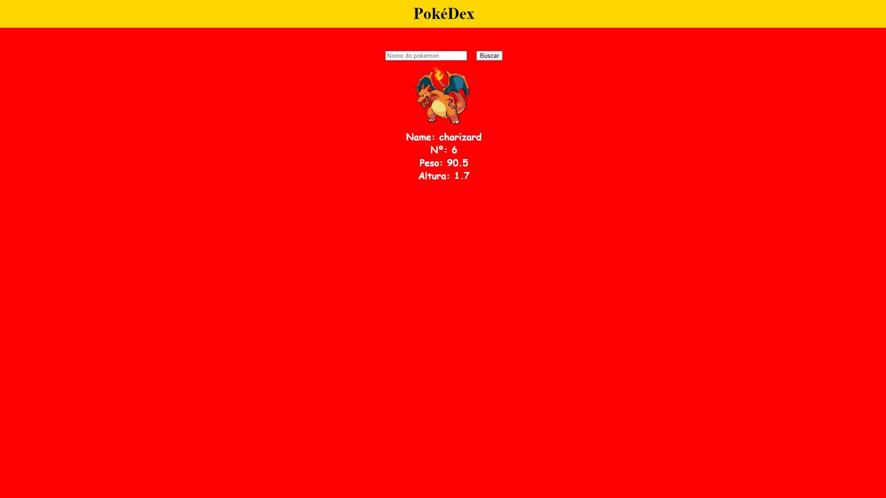

<h1 align="center">PokéDex</h1>
 

### ☁️ Deploy:

A <a href="https://github.com/LucasTKP/pokedex.git">PokéDex</a> está hospedado na Vercel.
   

### 💻 Projeto:

O projeto consiste em uma pokedex, onde o usuário vai digitar o nome do pokemon que deseja buscar as informações, e será puxado da api tudo deste pokemon.
Sempre que o usuário clicar no botão buscar, estou verificando se o input não esta vazio e se o nome do pokemon está correto

Contém as seguintes seções: Header, seção de pesquisa dos pokemons.
   

### 🎯 Objetivo:

Colocar em prática técnicas, conceitos e tecnologias utilizadas na aula de desenvolvimento web 3.
   

### ⚙️ Tecnologias:

- HTML
- CSS
- React JS
- Api "PokéApi"
     

### 📷 Tela inicial:

  

 
